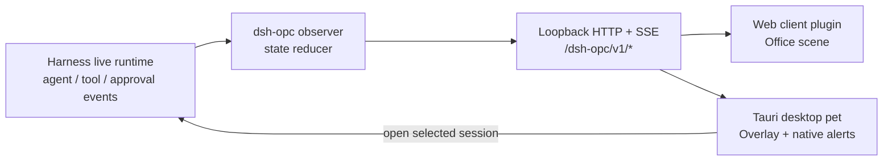

# dsh-opc implementation plan

## Goal

Build `dsh-opc` as an out-of-tree DeepSeek Harness bundle that makes each live
session visible as an anime office worker in the web client, then supplies a
separate Tauri desktop pet that remains visible when the browser is not. The
web and desktop surfaces must consume the same local, versioned observation
API; neither may reimplement Harness session inference from a transcript.

The first release is visual and observational. It does not alter agent,
approval, session, or tool execution semantics.

## Scope and boundaries

- Plugin: TypeScript only; a host-side Cordis plugin projects live agent,
  approval, tool, and error signals into a small read-only HTTP/SSE API, and a
  browser client plugin renders the office.
- Desktop pet: a separate Tauri 2 app with a TypeScript/HTML renderer and a
  minimal Rust backend for window, tray, loopback networking, and native
  notifications.
- Characters: supplied WebM assets play as predefined state loops. No runtime
  animation generation, physics engine, model inference, or automatic approval
  is in scope.
- Transport: the pet accepts only `http(s)` loopback DSH URLs. It may open the
  DSH web UI for a selected session, but it never exposes DSH over the network.
- Compatibility: target the checked-in DeepSeek Harness pre-release contracts
  directly and pin compatible peer dependency versions. Add compatibility
  shims only after an actual upstream break.

## Repository layout

Create the following structure in this currently empty repository:

```text
dsh-opc/
  package.json                 # Harness bundle and web-client declaration
  cordis.patch.yml             # host projection + browser root rows
  tsconfig.json
  tsdown.config.ts             # node and browser output entries
  src/
    index.ts                   # inert bundle root
    observer.ts                # host signal subscription and projection owner
    state-machine.ts           # pure per-session state reducer
    protocol.ts                # shared, versioned wire types and validation
    routes.ts                  # /dsh-opc state, sessions, assets, SSE routes
    assets.ts                  # asset manifest lookup and static serving
    client/
      index.ts                 # `dsh.client` browser entry and slot injection
      OfficePanel.tsx          # office scene and session worker cards
      session-store.ts         # snapshot/SSE client and reconnect policy
      playback.ts              # WebM preload, selection, and loop control
      styles.css
  assets/
    manifest.json
    characters/<character-id>/<state>.webm
  desktop/
    package.json               # Tauri scripts and release metadata
    src/renderer/              # TypeScript pet UI, protocol client, styles
    src-tauri/                 # Rust commands, tray, window lifecycle
  tests/
    state-machine.spec.ts
    observer.spec.ts
    routes.spec.ts
    client.spec.tsx
    desktop-notifications.spec.ts
  docs/agent/
```

The package manifest will follow the nearby `dsh-config` pattern: declare
`dsh.bundle.patch`, declare a web client with the UI slots/runtime injection it
uses, export `./client`, and build both the Node and browser entries. The
Cordis patch must add a host observer row and a browser-discoverable root row.

## Runtime architecture



`observer.ts` is the sole owner of ephemeral state. It subscribes as a Cordis
effect and disposes every listener with its fiber. It tracks each live agent by
session ID and uses a monotonic revision number to publish snapshots. The
projector should use, at minimum:

- `agent/created`, `agent/disposed`, and `agent/status` for session liveness
  and running/idle state;
- tool call/start and result/failure events (using the exact current Harness
  event contracts) for active tool name and terminal tool errors;
- `approval/request` only as an observation/gate wrapper that records an open
  manual request before delegating to `next()`, then clears it on settlement;
- durable session events where required to reconstruct a newly resumed
  session's latest error or to clear terminal status on the next turn.

Before implementation, verify the exact tool event names and replay fields in
the pinned Harness checkout. Do not infer “thinking” from missing events; it
means a live agent is running but has neither a pending approval nor an active
tool.

## Canonical session state

Use these externally visible states exactly:

| State | Meaning | WebM asset | Attention |
| --- | --- | --- | --- |
| `idle` | Agent is idle with no outstanding approval and ready for work. | `idle-0.webm` | no |
| `thinking` | Agent is running a model/step without a tool. | `thinking.webm` | no |
| `reading` | A read-only tool is active. | `reading.webm` | no |
| `writing` | A mutating/editing tool is active. | `writing.webm` | no |
| `await` | A manual approval is open. | `await-0.webm` | yes |
| `error` | The latest current-turn terminal failure has not been superseded by a new running turn. | `error.webm` | yes |

State precedence is deterministic:

1. `await`
2. `error`
3. active tool (`reading` or `writing`, classified by a configurable tool-name
   table with safe default `writing` for unknown tools)
4. `thinking` when `agent.status === "running"`
5. `idle`

Every session projection includes `id`, a display title, workspace label,
`state`, `stateSince`, `activeTool` when present, `approval` metadata safe for
display (tool name and reason, no arguments), error summary, and `runningSince`.
`runningSince` starts on the `idle → running` transition and is retained until
the session returns to idle or errors. Monotonic timestamps are used internally
for elapsed-time calculations; epoch timestamps are sent on the wire.

## Plugin-to-pet protocol

Namespace all routes under `/dsh-opc/v1` and return `apiVersion: 1` in every
JSON payload. Start with:

- `GET /state`: complete snapshot: revision, server time, session projections,
  and configured long-running thresholds.
- `GET /events`: SSE stream. Send a snapshot event immediately, then a
  `state` event after any material revision; include heartbeat comments so
  proxies/clients can detect stale connections.
- `GET /assets/manifest.json`: character IDs, available state files, video
  dimensions, poster/fallback asset, and animation loop policy.
- `GET /assets/...`: static immutable WebM and fallback assets, with safe path
  resolution and appropriate content types/cache headers.
- `GET /open?session=<id>` is deliberately deferred. In v1 the desktop pet
  opens the configured DSH URL; add an exact session deep link only after
  confirming the Harness web router contract.

The host route registrar owns all route disposers. Validate all query/path
inputs, reject traversal, emit `Cache-Control: no-store` for state, and never
send prompt text, tool arguments, credentials, or full stack traces. The
desktop client validates payload shape/version before rendering and reconnects
with bounded exponential backoff; it also periodically fetches `/state` as a
recovery path after SSE failure.

## Web office client

Register a browser client plugin through Harness UI slots. The preferred first
surface is a dismissible/resizable global office panel reachable from the
sidebar, with a compact session count badge. It renders one worker per current
projection in stable session-ID order, arranged at predefined desks; selection
reveals only the title, current state, elapsed duration, tool/approval reason,
and error summary.

Video playback requirements:

- preload the active and likely-next state videos, use muted `playsInline`
  video elements, and loop each predefined animation;
- crossfade only after `canplay`, retaining the prior poster/frame on load
  failure;
- respect `prefers-reduced-motion` by pausing on a representative poster;
- provide character/state textual labels and never use animation as the only
  status signal;
- treat missing character assets as a visible generic worker fallback, not a
  failed plugin activation.

Assign characters deterministically from a manifest roster by a stable hash of
session ID, so a session does not change appearance across refreshes. Layout is
visual only: it must not attempt to encode critical state through desk position
or color alone.

## Tauri desktop pet

Bootstrap a new Tauri 2 application in `desktop/`, borrowing the proven local
window/tray and reconnect approach from the adjacent `dsh-desktop-pet` project,
but using this plugin's `/dsh-opc/v1` contract. Keep presentation in TypeScript;
Rust supplies only native capabilities.

- Transparent, decoration-free, always-on-top, skip-taskbar window with a
  draggable visible handle; remember and clamp its position per display.
- System tray: show/hide, reconnect, open DSH, settings, quit. Closing the
  window hides it; quitting is explicit and clears the pet presence signal.
- Renderer shows a selected/highest-priority session character plus a compact
  alert queue and an expandable session list. Selection precedence is manual
  selection, permission, error, longest running, then most recently changed.
- The backend normalizes and restricts `--dsh-url` / configuration to loopback
  HTTP(S), owns SSE and snapshot fetching, and emits validated snapshots to the
  renderer. This keeps the renderer free of unrestricted network access.
- Native notifications originate in the backend. Clicking one focuses the pet
  and opens the configured DSH page; session-specific navigation remains a
  follow-up once verified.

## Notification policy

Persist notification ledger entries by `(sessionId, alertKind, milestone)` in
the app-data directory so reconnects/restarts do not repeat alerts.

- Long-running work: while `runningSince` remains active, notify once at every
  threshold in `5m, 10m, 20m, 30m, 45m, 60m`, then every 60 minutes. The
  notification is persistent where the platform supports it and includes the
  session title and elapsed time. Clear the active alert when the session turns
  idle, errors, or is disposed.
- Manual permission: notify immediately once per distinct pending approval.
  A changed approval identity/tool/reason is a new alert; state refreshes are
  not. Clear when the approval settles or session disappears.
- Error: notify once per error occurrence identity (turn/event ID when
  available; otherwise state transition plus error fingerprint). A new running
  turn clears it; a distinct later error notifies again.
- Coalesce simultaneous alerts into one summary notification plus the pet's
  visible list. Do not sound alerts by default; make sound, thresholds, and
  notification enablement user settings.

The initial protocol must expose enough stable identifiers to make this
deduplication correct. The pet must calculate thresholds from `runningSince`
and current time, not from the interval between SSE events.

## Delivery phases

1. Scaffold the bundle, build configuration, Cordis patch, shared protocol,
   empty observer, route registration, and a contract test that boots inside a
   minimal Harness composition.
2. Implement the pure reducer and host observer, including startup/resume
   projection, tool classification, approval lifecycle, error replacement, SSE
   revisions, and route/security tests.
3. Add the web client office panel, asset manifest/static serving, WebM
   fallback behavior, accessibility, and browser-level reconnection tests.
4. Bootstrap the Tauri pet; implement loopback validation, tray/window state,
   snapshot/SSE bridge, selected-session display, and native notification
   adapter.
5. Add milestone-alert persistence/coalescing, end-to-end manual-approval and
   error scenarios, packaging for Linux/Windows, and installation/operator
   documentation.

## Acceptance checks

- `pnpm build`, typecheck, and tests pass for both plugin and desktop projects.
- A Harness fixture with concurrent sessions demonstrates every canonical state
  and verifies the stated priority order.
- An SSE client receives a complete initial snapshot and exactly one revision
  update per material projection change; reconnect yields a convergent snapshot.
- A 5/10/20-minute fake-clock test proves alerts fire once per milestone,
  survive pet restart without duplication, and reset only under the documented
  state transitions.
- A pending approval and an error each produce one high-priority pet alert and
  are cleared when their identities resolve/supersede.
- Missing/corrupt WebM assets leave a labeled fallback worker visible in web
  and desktop clients.
- The pet rejects non-loopback URLs and protocol versions it does not support.
- Plugin disposal removes HTTP/SSE routes and all Harness listeners without
  leaving timers, subscriptions, or dangling approval wrappers.

## Decisions to resolve before phase 3

- Character art/licensing and the initial WebM roster, including posters and
  reduced-motion stills.
- The definitive current Harness tool lifecycle event(s) and whether their
  payload can distinguish read-only from mutating tools without a custom
  classifier override.
- The canonical web deep-link for opening a session from a desktop notification.
- Platforms supported for the first Tauri release (the adjacent project proves
  Linux/Windows; macOS should be explicitly included or deferred).
- Whether session titles/workspace labels are always acceptable to display in a
  desktop notification; provide a privacy mode that uses only counts if not.
